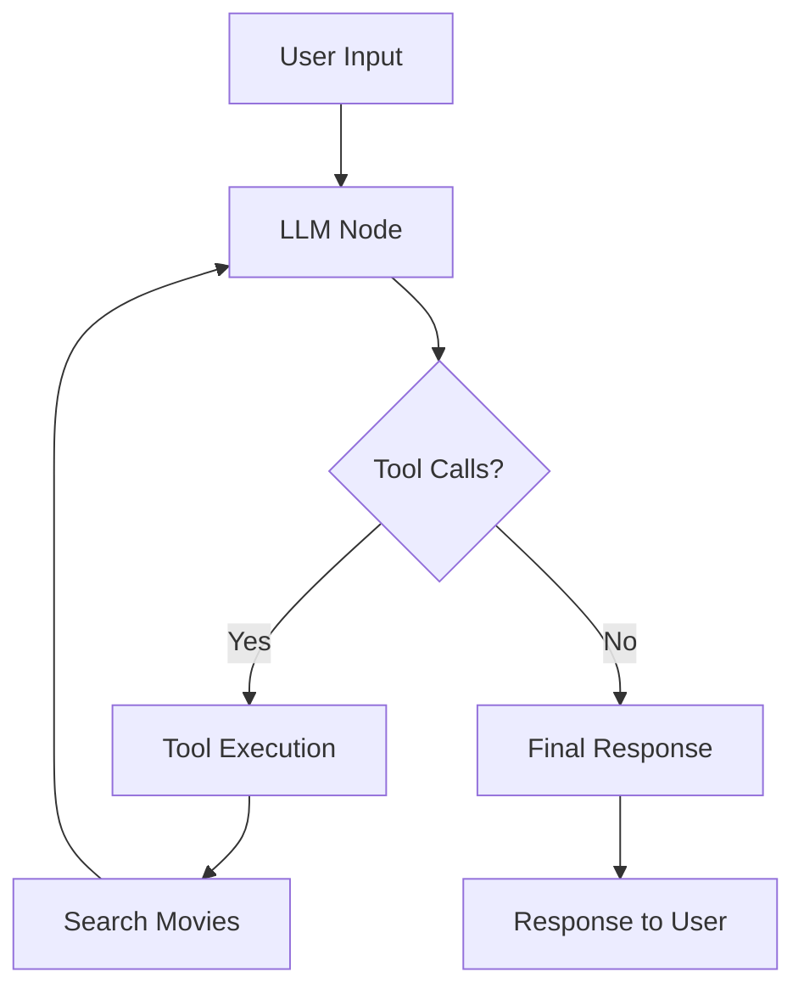

# 🎬 Movie Assistant AI

AI-powered movie recommendation API with conversational interface using FastAPI, LangGraph, and TMDB.

## 🚀 Quick Start

1. **Install dependencies**:
  ```bash
  python -m venv venv && source venv/bin/activate
  pip install -r requirements.txt
  ```

2. **Set up environment**:
  ```bash
  echo "tmdb_api_key=your_api_key_here" > .env
  ```

3. **Run server**:
  ```bash
  python main.py
  # Server starts at http://localhost:8000
  ```

## 🌐 API Endpoints

### Chat & AI Endpoints

#### `POST /chat`
- **Rate Limit**: 10/minute
- **Purpose**: Natural language movie queries
- **Example Request**:
```json
{
   "message": "Tell me about Interstellar",
   "session_id": "optional-session-id"
}
```

### Movie Data Endpoints

- `GET /movies/search/{query}` - Search movies (30/min)
- `GET /movies/popular` - Get popular movies (60/min)
- `GET /movies/top-rated` - Get top-rated movies (60/min)
- `GET /movies/{movie_id}/details` - Get movie details (50/min)
- `GET /movies/{movie_id}/watch-providers` - Get streaming info (40/min)
- `GET /movies/trending/{time_window}` - Get trending movies (50/min)

### Session Management

- `GET /sessions` - List active sessions (20/min)
- `POST /sessions/{session_id}/reset` - Clear history (15/min)
- `DELETE /sessions/{session_id}` - Delete session (10/min)

## ⚡ Rate Limiting

### Headers
```http
X-RateLimit-Limit: 10
X-RateLimit-Remaining: 8
X-RateLimit-Reset: 1642012345
```

## 🤖 AI Agent Architecture



### Available Tools
1. search_movies
2. get_movie_details
3. discover_movies
4. get_watch_providers

## 📱 Usage Examples

### Chat Query
```bash
curl -X POST "http://localhost:8000/chat" \
  -H "Content-Type: application/json" \
  -d '{
   "message": "Tell me about Interstellar"
  }'
```

### Movie Search
```bash
curl "http://localhost:8000/movies/search/Inception"
```

## 🚀 Production Deployment

### Docker
```dockerfile
FROM python:3.11-slim
WORKDIR /app
COPY requirements.txt .
RUN pip install -r requirements.txt
COPY . .
EXPOSE 8000
CMD ["uvicorn", "main:app", "--host", "0.0.0.0", "--port", "8000"]
```

### Environment Variables
```env
tmdb_api_key=your_production_api_key
FASTAPI_HOST=0.0.0.0
FASTAPI_PORT=8000
REDIS_URL=redis://localhost:6379
```

## 🤝 Contributing
1. Fork repository
2. Create feature branch
3. Submit pull request

## 📄 License
MIT License

**Built with ❤️ for movie enthusiasts**
